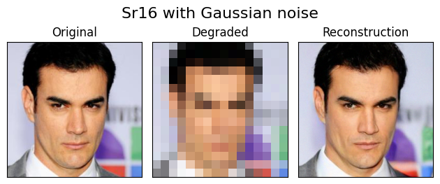

# Divide-and-Conquer Posterior Sampling for Denoising Diffusion Priors

The code of DCPS algorithm for solving Bayesian inverse problems with Diffusion models as prior.
The algorithm solves of the form

$$
y = \mathcal{A}(x) + n
,
$$

with the operator $\mathcal{A}$ being linear or non linear, and $n$ being Gaussian or Poisson noise.

DCPS is model agnostic whichs mean it can be used with any pre-trained diffusion model to solve bayesian inverse problem without further-training.

Refer to [Installation](./Installation.md) page to setup the project.

## DCPS in action

DCPS can solve a myriad of inverse problems with different priors.
Here, we showcase its results in two data types: trajectories and images; and on several inverse problems.

###  Trajectories

Here are the results fon three different trajectory completion tasks.

**Note:** The script ``training_trajectory.py`` can be used to train diffusion model on other trajectory datasets such SDD and ETH.

### Imaging

For image, we use DCPS in in conjunction with three diffusion models, Imagnet, CelebaHQ, and FFHQ.

## Running inverse problem algorithm

The two notebooks ``demo_images.py`` and ``demo_trajectory.py`` can be used to experiment with DCPS.

Also, these two notebooks can also be used to run other algorithm, namely *"ddrm", "dps", "mcgdiff", "pgdm", or "reddiff"*, to compare with DCPS.

Use the dataclass ``Config`` to customize the behavior of the script, more precisely

#### demo_images.py

- **model** (``str``) : Either "celebhq", "ffhq", or "imagenet"
- **n_steps** (``int``) : The number of diffusion steps to use
- **algo** (``str``) : Either "dcps", "ddrm", "dps", "mcgdiff", "pgdm", or "reddiff"
- **img_idx** (``str``) : the relative path of the image
- **task** (``str``) : Either "outpainting_half", "inpainting_middle", "outpainting_expand", "sr4", "sr16", "jpeg{QUALITY}" where QUALITY is an int between 1 and 100, for example "jpeg8"
- **noise_type** (``str``) : Either "gaussian" or "poisson"
- **std** (``float`` strictly positive) : the standard deviation of the noise
- **poisson_rate** (``float`` in (0, 1)) : rate of poisson noise
- **n_samples** (``int``): the number of samples to generate
- **device** (``str``): The device where to perform computation

#### demo_trajectory.py

- **algo** (``str``) : Either "dcps", "ddrm", "dps", "mcgdiff", "pgdm", or "reddiff"
- **n_steps** (``int``) : The number of diffusion steps to use
- **std** (``float`` strictly positive) : the standard deviation of the noise
- **n_samples** (``int``): the number of samples to generate
- **idx_selected** (``List[int]``) : List of the indices of the trajectory to consider
- **device** (``str``): The device where to perform computation

The considered problems here are three trajectory completion problems with observed coordinates being: beginning, middle, and end.
Change the mask ``missing_coordinates`` to consider other completion problems.

## Acknowledgement

This work as been supported by [Technology Innovation Institute (TII)](https://www.tii.ae).
<section align="left">
    
</section>